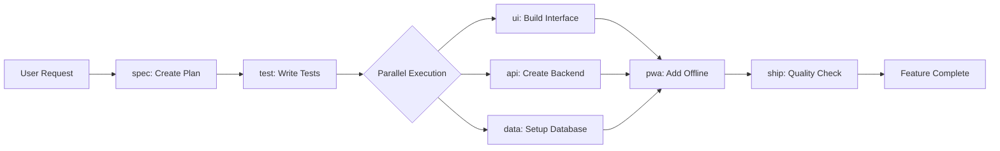

# CLAUDE.md

This file provides guidance to Claude Code (claude.ai/code) when working with code in this repository.

## Project Overview

This is a Progressive Web Application (PWA) boilerplate built with Next.js 15, TypeScript, and Supabase. It provides offline-first functionality with PowerSync, service worker support via Serwist, and a modern React 19 setup.

## Development Commands

```bash
pnpm dev          # Start development server (port 3000)
pnpm build        # Build for production
pnpm start        # Start production server
pnpm lint         # Run Biome linter and auto-fix issues
pnpm format       # Format code with Biome
pnpm typecheck    # Run TypeScript type checking
pnpm test         # Run unit tests with Vitest
pnpm test:e2e     # Run E2E tests with Playwright
```

### Testing Specific Files
```bash
pnpm test path/to/file.test.ts     # Run specific unit test
pnpm test:e2e path/to/test.spec.ts # Run specific E2E test
```

## Architecture

### Tech Stack
- **Frontend**: Next.js 15 (App Router), React 19, TypeScript 5.6+
- **Styling**: Tailwind CSS v4, shadcn/ui components
- **State Management**: 
  - TanStack Query v5 for server state
  - Zustand for client state
- **Offline Support**: PowerSync + Supabase, Serwist (service worker)
- **Forms**: React Hook Form + Zod validation
- **Testing**: Vitest (unit), Playwright (E2E)
- **Code Quality**: Biome (linting/formatting), TypeScript

### Directory Structure
```
app/                 # Next.js App Router pages
├── (auth)/         # Auth group routes
├── api/            # API routes
├── _components/    # Private route components
├── sw.ts          # Service worker configuration
└── providers.tsx   # React Query provider setup

components/         # Shared UI components
├── ui/            # shadcn/ui components

lib/               # Utilities and integrations
├── supabase/      # Supabase client setup
├── powersync/     # PowerSync configuration
├── validations/   # Zod schemas
└── utils.ts       # Helper functions

hooks/             # Custom React hooks
tests/             # Test files
├── unit/          # Vitest unit tests
├── e2e/           # Playwright E2E tests
└── setup.ts       # Test setup file
```

### Key Configurations

#### Next.js Configuration
- Service worker enabled via Serwist (disabled in development)
- Typed routes enabled for type-safe navigation
- Security headers configured (CSP, XSS protection, etc.)
- Image optimization for AVIF and WebP formats

#### Testing Setup
- Vitest with React Testing Library for unit tests
- Playwright configured for Chrome, Firefox, Safari, and mobile browsers
- Test coverage reporting enabled
- Path aliases configured (@/components, @/lib, etc.)

#### Code Style
- Biome for linting and formatting
- 2 spaces indentation
- Single quotes for JS, double quotes for JSX
- 100 character line width
- Semicolons as needed (ASI)

### PWA Features
- Manifest file at `/public/manifest.json`
- Service worker with offline page support
- Install prompt component integration
- Network-first caching strategy for API routes

### Environment Variables Required
```env
# Supabase (Required)
NEXT_PUBLIC_SUPABASE_URL=
NEXT_PUBLIC_SUPABASE_ANON_KEY=

# Optional
ELEVENLABS_API_KEY=
NEXT_PUBLIC_POSTHOG_KEY=
```

## Important Patterns

### Component Structure
- Use functional components with TypeScript
- Follow existing shadcn/ui patterns for new UI components
- Client components marked with 'use client' directive
- Server components by default in App Router

### State Management
- Use TanStack Query for server data fetching
- Zustand for UI state and local preferences
- React Hook Form for form handling
- Always validate with Zod schemas

### Error Handling
- Retry logic configured in QueryClient (max 2 retries)
- Skip retries for 404 and 401 errors
- 1-minute stale time for queries

### Security Best Practices
- Row Level Security enabled in Supabase
- Security headers configured in next.config.mjs
- Never commit sensitive data or API keys
- Use environment variables for configuration

## Feature-Driven Development Workflow

### How It Works

When you request a feature, Claude automatically:
1. Creates a comprehensive specification using the `spec` agent
2. Saves it to `features/feature-[name].md`
3. Orchestrates specialized agents to implement it
4. Follows Test-Driven Development (tests written first)
5. Ensures optimal UX, performance, and offline capability

### Just Ask Naturally

Simply describe what you need:
- "Add user authentication with email and password"
- "Create a dashboard with real-time charts"
- "Build an offline-capable todo list"
- "Implement payment processing with Stripe"

No special commands needed - Claude understands and orchestrates everything.

## The Elite Seven Agents

Specialized AI agents handle different aspects of development:

| Agent | Purpose | Specialization |
|-------|---------|----------------|
| **spec** | Feature Architect | Creates comprehensive specifications, learns from implementation outcomes |
| **test** | TDD Guardian | Writes tests BEFORE code exists, learns from escaped bugs |
| **ui** | Visual Experience | Beautiful, accessible interfaces, learns from user behavior |
| **api** | Backend Engineer | Robust APIs with Supabase, self-optimizes performance |
| **data** | Data Orchestrator | Database, offline sync, learns query patterns |
| **pwa** | Mobile Experience | Native app-like features, optimizes caching |
| **ship** | Quality & Deploy | Production readiness, learns from deployments |

### Agent Orchestration Flow



## Self-Evolution System

### How Agents Learn and Improve

Agents continuously evolve based on:
- **Implementation Outcomes**: Learn what works and what doesn't
- **Performance Metrics**: Optimize based on real data
- **Error Patterns**: Prevent recurring issues
- **User Behavior**: Adapt to actual usage
- **Team Preferences**: Align with developer patterns

### Learning Infrastructure

```
.claude/
├── agents/              # Agent definitions
│   ├── spec.md         # Feature Architect
│   ├── test.md         # TDD Guardian
│   ├── ui.md           # Visual Experience
│   ├── api.md          # Backend Engineer
│   ├── data.md         # Data Orchestrator
│   ├── pwa.md          # Mobile Experience
│   └── ship.md         # Quality & Deploy
├── learning/           # Self-evolution data
│   ├── patterns/       # Successful patterns
│   ├── failures/       # Failure analysis
│   ├── metrics/        # Performance tracking
│   └── evolution/      # Agent evolution history
```

### Evolution Cycle

1. **Execute**: Agents perform tasks
2. **Measure**: Track success metrics
3. **Analyze**: Identify patterns
4. **Adapt**: Update strategies
5. **Validate**: Confirm improvements

### Agent Configuration Evolution

Agents can self-modify their configurations:
- Add frequently needed tools
- Upgrade models based on performance
- Refine descriptions for better invocation
- Learn domain-specific patterns
- Share learnings with other agents

## Feature Specification Structure

Every feature automatically gets a comprehensive specification:

### 1. Executive Summary
- Feature overview and business value
- Success metrics and KPIs

### 2. Visual Design 🎨
- Component hierarchy
- Responsive layouts
- Animations and interactions
- Accessibility requirements

### 3. User Stories 📖
- User journeys
- Acceptance criteria
- Edge cases
- Offline behavior

### 4. Technical Architecture 🏗️
- Database schema (Supabase)
- API design
- State management
- PowerSync configuration

### 5. Testing Strategy 🧪
- Unit tests (Vitest)
- E2E tests (Playwright)
- Performance benchmarks
- Security testing

### 6. Implementation Phases 🚀
- Step-by-step plan
- Agent assignments
- Time estimates
- Dependencies

## Quality Standards

Every feature must meet:
- ✅ All tests passing (100%)
- ✅ Code coverage > 90%
- ✅ Lighthouse PWA score > 95
- ✅ WCAG 2.1 AA compliance
- ✅ Core Web Vitals targets met
- ✅ Bundle size < 200KB per route
- ✅ TypeScript strict mode
- ✅ Works offline
- ✅ Mobile-first responsive
- ✅ Zero console errors

## Common Workflows

### Creating a New Feature

```bash
# Simply describe what you want
User: "Add a real-time chat feature with typing indicators"

# Claude automatically:
# 1. Creates features/feature-chat.md specification
# 2. Writes comprehensive tests first
# 3. Implements with appropriate agents
# 4. Ensures offline capability
# 5. Validates quality standards
```

### Improving Existing Code

```bash
User: "Optimize the dashboard performance"

# Agents collaborate to:
# 1. Analyze current performance
# 2. Identify bottlenecks
# 3. Implement optimizations
# 4. Validate improvements
```

### Fixing Bugs

```bash
User: "Users report login fails when offline"

# Agents will:
# 1. Write tests to reproduce the issue
# 2. Fix the root cause
# 3. Ensure offline functionality
# 4. Prevent regression
```

## Best Practices

### For Optimal Results

1. **Be Specific**: "Add user profiles with avatar upload" > "Add profiles"
2. **Mention Requirements**: "Make it work offline" if critical
3. **Trust the Process**: Let agents handle the implementation details
4. **Review Specifications**: Check the generated feature spec before proceeding
5. **Provide Feedback**: Agents learn from your preferences

### Working with Agents

- Agents work autonomously but you can request specific ones
- Example: "Have the ui agent improve this design"
- Example: "Get the test agent to add more edge cases"
- Example: "Ask ship agent to check performance"

## Monitoring Agent Performance

### Agent Metrics

Track agent effectiveness:
- Task completion rate
- Code quality metrics
- Bug escape rate
- Performance impact
- Developer satisfaction

### Continuous Improvement

Agents improve through:
- Post-implementation reviews
- Performance monitoring
- Error pattern analysis
- User feedback
- Cross-agent learning

## Troubleshooting

### Common Issues

**Agent not responding as expected**
- Check agent definition in `.claude/agents/`
- Verify tools are available
- Review recent evolution history

**Tests failing**
- test agent writes comprehensive tests that may reveal issues
- This is good - fix the implementation, not the tests

**Performance degradation**
- ship agent will catch this before deployment
- Use perf metrics to identify cause

## Advanced Usage

### Custom Agent Configuration

Modify agents for your specific needs:
1. Edit `.claude/agents/[agent].md`
2. Adjust tools, model, or system prompt
3. Agents will adapt and learn from changes

### Feature Templates

Common features have optimized templates:
- Authentication systems
- Payment processing
- Data tables
- Forms and validation
- Real-time features
- File uploads

### Integration with CI/CD

Agents work with your pipeline:
- Pre-commit: lint agent validates
- Pre-merge: test agent ensures coverage
- Pre-deploy: ship agent checks quality
- Post-deploy: Monitors and learns